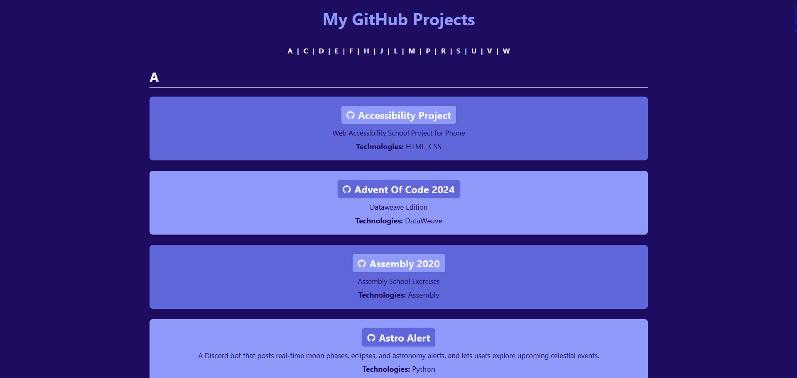

<div align="center">
  
# My GitHub Projects
[](https://github.com/EduardaSRBastos/my-projects?tab=MIT-1-ov-file)
[](https://github.com/EduardaSRBastos/my-projects/releases)
[](https://github.com/EduardaSRBastos/my-projects/actions)
[](https://github.com/EduardaSRBastos/my-projects)

<p><i>A directory website that lists my GitHub projects.</i></p>

<kbd>  </kbd>

 </div>

<br>

## Table of Contents
- [Features](#features)
- [How to Use](#how-to-use)
- [Projects](#projects)
- [Performance Score](#pagespeed-insights-performance-score)
- [Contributing](#contributing)
- [License](#license)

<br>

## Features

- **Alphabetical Project Index**: All your projects are organized from A-Z for easy browsing.  
- **Project Descriptions**: Each project shows a short summary with technologies used.  
- **Links to GitHub and Live Website**: Quick access to both the repository and live demo.  
- **Responsive Design**: Works well on desktop, tablet, and mobile.  
- **Easy to Update**: Add a new repository and regenerate the list automatically.  
- **.env Integration**: Securely store your GitHub username and personal access token for API access.

<br>

## How to Use

> **Note:** This script is designed to work only with the [repository template](https://github.com/EduardaSRBastos/repository-template). Other projects may not be compatible.

1. **Clone the Repository Template**:  
   ```bash
   git clone https://github.com/EduardaSRBastos/repository-template.git
   cd repository-template
   ```

2. **Set Up Your Environment**: In the root of your project (created from the template), create a `.env` file with the following variables:
    ```env
    GITHUB_USERNAME=YourGitHubUsername
    GITHUB_TOKEN=YourPersonalAccessToken
    ```
   > You can leave `GITHUB_TOKEN` empty for unauthenticated requests, but rate limits will be low.  

3. **Run the Script**: Execute `generate_README_projects_list.py` to automatically generate your README-style project list.  

4. **Deploy/Update Website**: Embed the generated list in your README file.  

5. **Add New Projects**: When you add new repositories, simply re-run the script to update the list automatically.

<br>

## Projects

[A](#A) - [C](#C) - [D](#D) - [E](#E) - [F](#F) - [H](#H) - [J](#J) - [L](#L) - [M](#M) - [P](#P) - [R](#R) - [S](#S) - [U](#U) - [V](#V) - [W](#W)

<a id="A"></a>

### A

- [**Accessibility Project:**](https://github.com/EduardaSRBastos/AccessibilityProject) Web Accessibility School Project for Phone

- [**Advent Of Code 2024:**](https://github.com/EduardaSRBastos/advent-of-code-2024) Dataweave Edition

- [**Assembly 2020:**](https://github.com/EduardaSRBastos/Assembly-2020) Assembly School Exercises

- [**Astro Alert:**](https://github.com/EduardaSRBastos/astro-alert) A Discord bot that posts real-time moon phases, eclipses, and astronomy alerts, and lets users explore upcoming celestial events.

<a id="C"></a>

### C

- [**C 2019:**](https://github.com/EduardaSRBastos/C-2019) C School Exercises

- [**Calculator:**](https://github.com/EduardaSRBastos/calculator) An aesthetic calculator with hidden tricks and a cat-like style.


- [**Cpp 2020:**](https://github.com/EduardaSRBastos/Cpp-2020) C++ School Exercises

- [**Cpp 2021:**](https://github.com/EduardaSRBastos/Cpp-2021) C++ School Exercises (Btree)

- [**Csharp.net 2017:**](https://github.com/EduardaSRBastos/CSharp.NET-2017) C# .NET School Exercises

- [**Csharp.net Console 2017:**](https://github.com/EduardaSRBastos/CSharp.NET-Console-2017) C# .NET Console School Exercises

- [**Css Projects:**](https://github.com/EduardaSRBastos/css-projects) Animation Projects using HTML, CSS and JS

<a id="D"></a>

### D

- [**Dataweave Challenges:**](https://github.com/EduardaSRBastos/dataweave-challenges) DataWeave challenges from <a href="https://www.prostdev.com/">ProstDev.com</a> with explanations

- [**Dataweave Exercises:**](https://github.com/EduardaSRBastos/dataweave-exercises) Dataweave practical exercises

- [**Dataweave Utilities:**](https://github.com/EduardaSRBastos/dataweave-utilities) Collection of useful dataweave functions

- [**Distributed Systems 2022:**](https://github.com/EduardaSRBastos/DistributedSystems-2022) Distributed Systems School Projects in C and C#

<a id="E"></a>

### E

- [**EduardaSRBastos:**](https://github.com/EduardaSRBastos/EduardaSRBastos) My Profile Readme

- [**Escape Puzzle:**](https://github.com/EduardaSRBastos/escape-puzzle) Escape Puzzle in HTML, JS and CSS.

<a id="F"></a>

### F

- [**Final Project 2018:**](https://github.com/EduardaSRBastos/FinalProject-2018) Technological Project of the Informatics and Multimedia Technologies Course (Colégio de Gaia)

- [**Food Api Django:**](https://github.com/EduardaSRBastos/FoodAPI_Django) Django exercise

<a id="H"></a>

### H

- [**Hanabi:**](https://github.com/EduardaSRBastos/Hanabi) Game Hanabi written in C

- [**Hiring Coders:**](https://github.com/EduardaSRBastos/HiringCoders) Programa Hiring Coders

- [**Html Css Php Js 2017:**](https://github.com/EduardaSRBastos/HTML-CSS-PHP-JS-2017) WEB Development School Exercises

<a id="J"></a>

### J

- [**Java Udemy Course:**](https://github.com/EduardaSRBastos/java-udemy-course) <a href="https://udemy-redirect-app.herokuapp.com/java">The Complete Java Development Bootcamp</a> Exercises

<a id="L"></a>

### L

- [**Lettersoup:**](https://github.com/EduardaSRBastos/LetterSoup) Game Letter Soup written in C++

<a id="M"></a>

### M

- [**Malassezia Checker:**](https://github.com/EduardaSRBastos/malassezia-checker) A tool that checks ingredients for potential Malassezia triggers.


- [**My Essential Toolbox:**](https://github.com/EduardaSRBastos/my-essential-toolbox) A collection of essential digital tools designed to assist with everyday tasks.


<a id="P"></a>

### P

- [**Pin Journey:**](https://github.com/EduardaSRBastos/pin-journey) An interactive map to track and visualize the places you've been.


- [**Portfolio:**](https://github.com/EduardaSRBastos/portfolio) My Portfolio Website

- [**Powerbi 2022:**](https://github.com/EduardaSRBastos/PowerBI-2022) Power BI School Exercises

- [**Profile Preferences Api:**](https://github.com/EduardaSRBastos/profile-preferences-api) The API allows users to create their account preferences.

- [**Python Exercises:**](https://github.com/EduardaSRBastos/Python-Exercises) Python School Exercises

- [**Python Genderidecg:**](https://github.com/EduardaSRBastos/Python-GenderIdECG) Gender Identification with Electrocardiography in Python

<a id="R"></a>

### R

- [**Repository Template:**](https://github.com/EduardaSRBastos/repository-template) A structured GitHub template with essential resources for new projects.

- [**Resume Builder:**](https://github.com/EduardaSRBastos/resume-builder) A customizable resume builder template built using HTML, CSS, and JavaScript.


- [**Rss Reader:**](https://github.com/EduardaSRBastos/RssReader) Project using WPF and Xamarin Forms (c#)

<a id="S"></a>

### S

- [**Samurai:**](https://github.com/EduardaSRBastos/samurai) Project made in Angular and C#

- [**Spotify Lyrics:**](https://github.com/EduardaSRBastos/Spotify-Lyrics) Displays the currently playing Spotify track and its lyrics

- [**Sql 2021:**](https://github.com/EduardaSRBastos/SQL-2021) SQL School Exercises

<a id="U"></a>

### U

- [**Uml 2021:**](https://github.com/EduardaSRBastos/UML-2021) UML School Exercises

- [**Unity 2018:**](https://github.com/EduardaSRBastos/Unity-2018) Unity School Exercises

- [**Update License Year Action:**](https://github.com/EduardaSRBastos/update-license-year-action) This GitHub Action automatically updates the year in the `LICENSE` file of the repository.

<a id="V"></a>

### V

- [**Vb 2016:**](https://github.com/EduardaSRBastos/VB-2016) Visual Basic School Exercises

- [**Vb.net 2016:**](https://github.com/EduardaSRBastos/VB.NET-2016) Visual Basic .NET School Exercises

- [**Vision Simulator:**](https://github.com/EduardaSRBastos/vision-simulator) A vision simulator that recreates how humans and animals perceive the world through various visual conditions and color deficiencies.


<a id="W"></a>

### W

- [**Webgl 2022:**](https://github.com/EduardaSRBastos/WebGL-2022) WebGL School Exercises

- [**Webgl Project:**](https://github.com/EduardaSRBastos/WebGL-Project) Project Candyland in WebGL

- [**What To Eat:**](https://github.com/EduardaSRBastos/what-to-eat) Interactive web app to choose what to eat by swiping food options left or right.


- [**Wpf 2021:**](https://github.com/EduardaSRBastos/WPF-2021) WPF School Exercises


## PageSpeed Insights Performance Score
<div align="center">
  
| [Desktop](https://pagespeed.web.dev/analysis/https-eduardasrbastos-github-io-my-projects/zacmq8kevy?form_factor=desktop) | [Mobile](https://pagespeed.web.dev/analysis/https-eduardasrbastos-github-io-my-projects/zacmq8kevy?form_factor=mobile) |
|-------|-------|
| <kbd>  </kbd> | <kbd>  </kbd> |

</div>

## Contributing
- Support this project by giving it a star ⭐. Thanks!
- Feel free to suggest improvements or report any issues in the repository.

## License
This project is licensed under the MIT License - see the [LICENSE](LICENSE) file for details.

